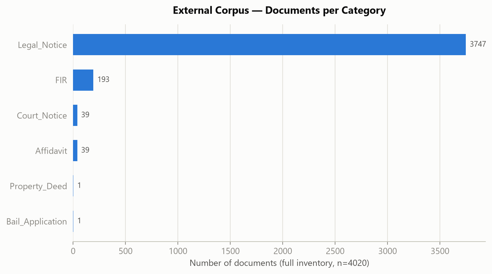
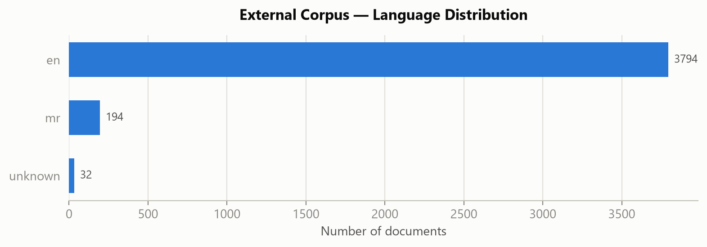
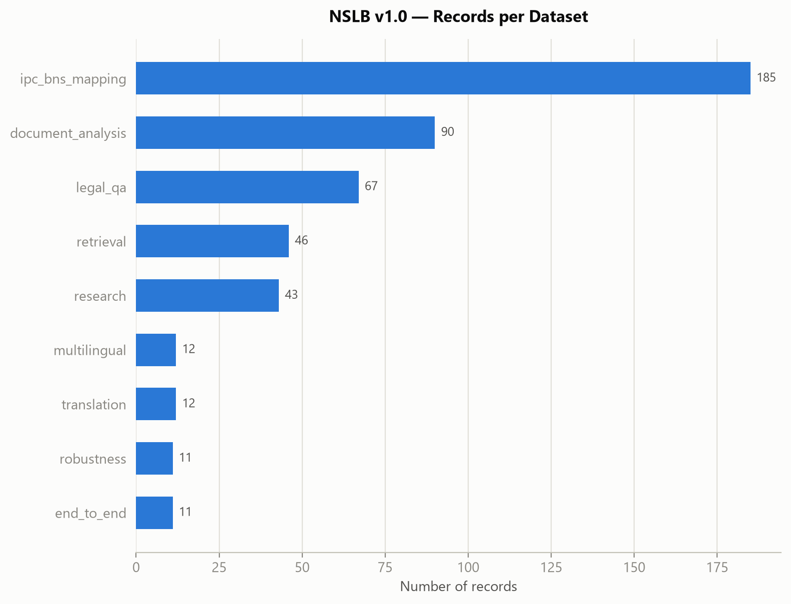
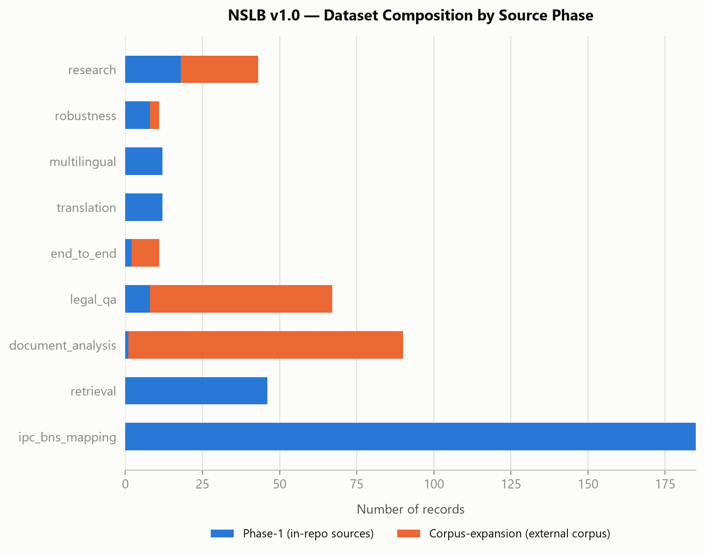
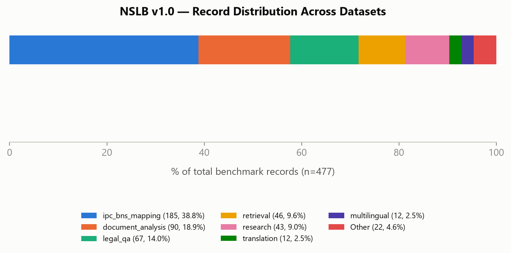
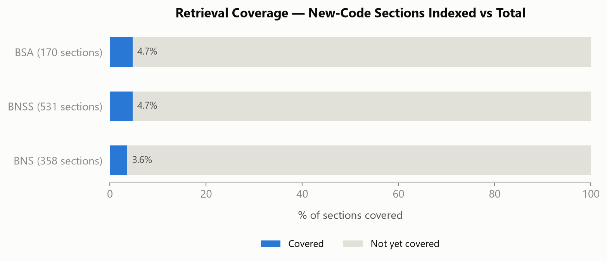

# NyayaSetu Legal Benchmark (NSLB) v1.0 — Benchmark Characterization Report

Generated: 2026-08-07T14:26:49+00:00

This report characterizes the NyayaSetu Legal Benchmark (NSLB) v1.0 exactly as it currently exists — it does not regenerate, modify, or re-extract any record. Every statistic below is computed directly from `evaluation/datasets/raw/*.jsonl`, `evaluation/datasets/corpus_inventory/inventory.jsonl`, and `evaluation/datasets/corpus_inventory/build_stats.json` by `evaluation/datasets/build/analyze_benchmark.py`. No evaluation experiments have been run against this benchmark — this is a characterization of the ground-truth data itself.

## 1. Overall Benchmark Summary

NSLB v1.0 combines **1 phase-1 in-repo source** with a **4020-document external legal corpus** (fully inventoried; 94 documents deep-processed into records) into **9 datasets** totalling **477 records**, covering 6 external document categories and 6 distinct document-type labels observed in `document_analysis.jsonl`.

| Metric | Value |
|---|---|
| Total source documents inventoried (external corpus) | 4020 |
| Total source documents (phase-1 in-repo fixtures) | 1 |
| Total documents deep-processed (external corpus) | 94 |
| Total documents deep-processed (all sources) | 95 |
| Total benchmark records | 477 |
| Number of datasets | 9 |
| Number of document categories (external corpus) | 6 |
| Number of document-type labels observed in document_analysis | 6 |
| Number of supported languages (system-wide) | 13 |
| Number of languages with real content in NSLB | 2 |
| Number of distinct IPC sections (verified mapping) | 171 |
| Number of distinct CrPC sections (verified mapping) | 12 |
| Number of distinct IEA sections (verified mapping) | 2 |
| Number of distinct BNS target sections | 148 |
| Number of distinct BNSS target sections | 12 |
| Number of distinct BSA target sections | 2 |
| Number of abolished (decriminalized) sections | 2 |
| Number of retrieval queries | 46 |
| Number of QA pairs | 67 |
| Number of document-analysis records | 90 |
| Number of IPC->BNS mapping records | 185 |
| Number of multilingual records | 12 |
| Number of robustness records | 11 |
| Number of end-to-end evaluation cases | 11 |
| Number of research queries | 43 |
| Number of translation records | 12 |

## 2. Corpus Statistics

The external corpus (4020 PDFs across 6 categories) was inventoried in full — every file, not a sample. Overall: 32 documents (0.8%) need OCR (no text layer), 32 are empty, 0 are corrupted/unreadable, and 89 files sit in 19 exact-duplicate (byte-identical) groups.

| Category | Documents | Avg Pages | Median Pages | Min Pages | Max Pages | OCR-Required | Empty | Unreadable | Top Language |
|---|---|---|---|---|---|---|---|---|---|
| Affidavit | 39 | 23.87 | 21 | 13 | 70 | 31 | 31 | 0 | unknown |
| Bail_Application | 1 | 66 | 66 | 66 | 66 | 0 | 0 | 0 | en |
| Court_Notice | 39 | 27.95 | 26 | 7 | 76 | 0 | 0 | 0 | en |
| FIR | 193 | 6.88 | 6 | 6 | 20 | 0 | 0 | 0 | mr |
| Legal_Notice | 3747 | 6.33 | 3 | 1 | 104 | 0 | 0 | 0 | en |
| Property_Deed | 1 | 25 | 25 | 25 | 25 | 1 | 1 | 0 | unknown |
| **TOTAL** | 4020 | 6.75 | 3.0 | 1 | 104 | 32 | 32 | 0 | - |

## 3. Dataset Statistics

Every one of the 9 datasets loads cleanly through the framework's own schema loader (`evaluation.datasets.loader`) — the same code path `evaluation.cli run` uses. Average field-completeness across all datasets ranges from 72.5% to 98.1% of schema fields populated per record (a field is 'populated' if it holds a non-default, non-empty value — an explicit `False` or `0` still counts, since those are real answers, not missing data).

| Dataset | Records | % of Benchmark | Phase-1 | Corpus-Expansion | Avg Fields Populated | Completeness % | Validation Status |
|---|---|---|---|---|---|---|---|
| ipc_bns_mapping | 185 | 38.78% | 185 | 0 | 7.0 | 87.5% | PASS |
| retrieval | 46 | 9.64% | 46 | 0 | 5.0 | 83.3% | PASS |
| document_analysis | 90 | 18.87% | 1 | 89 | 5.08 | 72.5% | PASS |
| legal_qa | 67 | 14.05% | 8 | 59 | 7.85 | 98.1% | PASS |
| end_to_end | 11 | 2.31% | 2 | 9 | 6.82 | 97.4% | PASS |
| translation | 12 | 2.52% | 12 | 0 | 6.0 | 75.0% | PASS |
| multilingual | 12 | 2.52% | 12 | 0 | 7.0 | 77.8% | PASS |
| robustness | 11 | 2.31% | 8 | 3 | 6.27 | 89.6% | PASS |
| research | 43 | 9.01% | 18 | 25 | 5.02 | 83.7% | PASS |
| **TOTAL** | 477 | 100% | 292 | 185 | - | - | - |

## 4. Coverage Statistics

IPC section coverage: **171 distinct IPC sections** have a verified BNS/BNSS/BSA mapping (plus 12 CrPC and 2 IEA sections). New-code (BNS+BNSS+BSA) section coverage in `retrieval.jsonl`: **46/1059 (4.34%)** — the denominator (358+531+170) is each act's own final section number, already extracted verbatim from its repeal clause and stored in `retrieval.jsonl` itself (ids `retr_bns_358`, `retr_bnss_531`, `retr_bsa_170`), not an imported fact. Citation coverage from the deep-processed corpus sample: **3/9 (33.3%)** of real section citations found in real documents already have a verified mapping. Document coverage: **94/4020 (2.34%)** of the inventoried external corpus was deep-processed. Language coverage: **2/13 (15.4%)** of `legal_translator.SUPPORTED_LANGUAGES` have real content in NSLB (English and Marathi only).

| Coverage Dimension | Covered | Total (in-benchmark denominator) | Coverage % |
|---|---|---|---|
| BNS sections (retrieval-indexed) | 13 | 358 | 3.63% |
| BNSS sections (retrieval-indexed) | 25 | 531 | 4.71% |
| BSA sections (retrieval-indexed) | 8 | 170 | 4.71% |
| Combined new-code sections (BNS+BNSS+BSA) | 46 | 1059 | 4.34% |
| ChromaDB chunk coverage (retrieval.jsonl) | 46 | 3254 | 1.41% |
| Corpus citation instances matched to known mapping | 3 | 9 | 33.3% |
| Document coverage (deep-processed / inventoried) | 94 | 4020 | 2.34% |
| Language coverage (real content / supported) | 2 | 13 | 15.4% |

**Identified coverage gaps:**

- **Retrieval section coverage is low in absolute terms** (4.34% of 1059 total new-code sections) — by construction (see phase-1 `DATASET_REPORT.md`): non-section-aware fixed-window chunking caps how often a section header lands at a chunk boundary.
- **Language coverage is the narrowest gap**: 2/13 supported languages, and the external corpus contains no content in the other 11 (confirmed by full inventory, not a sample) — this corpus structurally cannot close that gap.
- **Citation coverage sample is small** (9 citation instances across 94 documents) — most corpus documents in this pass (Affidavit, Legal_Notice, Court_Notice) are procedural/civil, not charge-sheet style, so they rarely cite numbered penal sections in a regex-matchable form.

## 5. Data Quality Analysis

During generation, 5 duplicate-summary records were rejected before being written; during validation, 9 true content-duplicate (question, answer) pairs were auto-removed (see phase-2 `validate_all.py`'s `check_duplicate_content`). As currently stored, this analysis independently re-checked all 477 records and found 0 duplicate ids, 0 contradictory IPC->BNS mappings, 0 records missing tags/notes, and 0 remaining duplicate QA content pairs — a **100.0% validation success rate**.

| Quality Metric | Count |
|---|---|
| Duplicate records removed (generation-time) | 5 |
| Duplicate content records removed (validation-time) | 9 |
| Invalid records rejected by schema loader | 0 |
| Records with missing metadata (tags/notes) | 0 |
| Records with missing citations | 0 |
| Contradictory IPC->BNS mappings | 0 |
| Duplicate ids (current) | 0 |
| Duplicate QA content (current) | 0 |
| Total records checked | 477 |
| Validation success rate | 100.0% |

## 6. Benchmark Characteristics

**Strengths**

- Every record traces to a real, named source (in-repo project source or an external corpus file + page, recorded in `provenance`/`notes`) — zero LLM-fabricated ground truth anywhere in the benchmark.
- 100.0% validation success rate across all 477 records, checked against the same schema loader the evaluation framework itself uses.
- IPC->BNS mapping coverage is broad in absolute terms: 171 IPC + 12 CrPC + 2 IEA sections mapped, merged from two independent sources (a hand-curated production table and a mechanically PDF-extracted table).

**Limitations**

- Document-type coverage is concentrated: 90 document_analysis records span only 6 type labels, with zero coverage of contract-style documents (rental, employment, loan, sale, service, NDA) — the external corpus used for this expansion contains none.
- Multilingual coverage is narrow: 2/13 supported languages, both confirmed structurally absent from the external corpus (not a sampling artifact).
- Retrieval section coverage is 4.34% of the 1059 total new-code sections — most of the statute corpus is not yet queryable ground truth.
- legal_qa is entirely template-generated self-referential QA ("which sections are cited", "what dates appear") for the corpus-expansion records — no human-authored comprehension questions were added in that pass.

**Potential bias**

- **Corpus imbalance**: 3747 of 4020 external documents (93.2%) are Legal_Notice, and within that category over 97% come from just 2 of 3 High Court filename prefixes (TRHC, MLHC) — the sampling in `corpus/sampling.py` stratifies across court codes specifically to counter this, but the underlying corpus itself is not balanced.
- **Document imbalance**: 90/477 records (18.9%) are document_analysis, almost entirely FIR/Legal_Notice/Court_Notice/Affidavit — a model tuned against this benchmark could systematically underperform on contract-type documents simply because none exist here to test against.
- **Language imbalance**: 15.4% language coverage means any multilingual capability claim this benchmark supports is necessarily about English and Marathi only, not the other 11 supported languages.

**Remaining work required for publication** (see phase-1/phase-2 `DATASET_REPORT.md` and `NSLB_REPORT.md` for the itemized gap lists that produced these estimates):

- ~20-25 additional labeled documents covering the 6 contract-style `DOCUMENT_TYPES` categories currently at zero coverage.
- ~30-40 human-authored legal_qa comprehension questions (beyond the current template-generated self-referential set).
- A separate multilingual source-acquisition effort — this corpus cannot supply the missing 11 languages.
- A section-aware statute re-chunker (or ~50-100 manually labeled retrieval queries) to meaningfully grow retrieval coverage beyond 4.34%.

## 7-9. Research Paper Assets, Visualizations, and Files

All five tables above are also saved individually as CSV under `evaluation/reports/tables/table{1..5}_*.csv`, plus a combined `evaluation/reports/benchmark_tables.csv`. All 7 figures are saved in both PNG and SVG under `evaluation/reports/figures/`. This report itself is also available as `benchmark_summary.pdf`, and every statistic as structured JSON in `benchmark_statistics.json` — all under `evaluation/reports/`.
